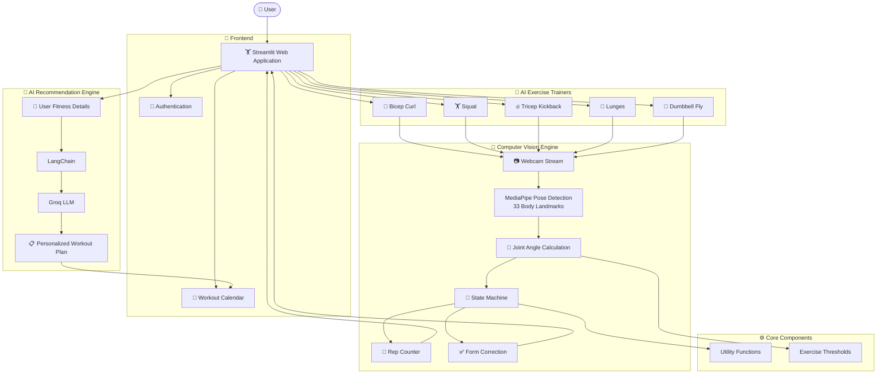

<p align="center">
  
</p>

<h1 align="center">
🏋️ AI Fitness Trainer
</h1>

<p align="center">
An AI-powered personal fitness coach that delivers <b>real-time exercise tracking</b>, <b>pose estimation</b>, <b>form correction</b>, and <b>personalized workout recommendations</b> using Computer Vision and Large Language Models.
</p>

<p align="center">
  
  
  
  
  
  
  
</p>

---

## 🚀 Overview

AI Fitness Trainer is an intelligent virtual workout assistant that combines **Computer Vision**, **Pose Estimation**, and **Generative AI** to help users perform exercises with proper form.

Using a webcam, the application detects body landmarks in real time, counts repetitions, analyzes posture, provides instant corrective feedback, and even generates personalized workout plans based on individual fitness goals.

Unlike traditional fitness trackers, this project functions as an interactive AI coach capable of monitoring exercise performance while recommending customized training routines.

---

## ✨ Key Highlights

✅ Real-time AI Pose Detection

✅ Automatic Rep Counter

✅ Live Form Correction

✅ Personalized AI Workout Recommendations

✅ Interactive Workout Calendar

✅ Secure User Authentication

✅ Multiple Exercise Trainers

✅ Modern Streamlit Dashboard

---

## 🎯 Supported Exercises

- 💪 Bicep Curl
- 🏋️ Squats
- 🔥 Tricep Kickback
- 🚶 Lunges
- 🪽 Dumbbell Fly

---

## 📸 Preview

> Replace these screenshots with your own images.

| Home | AI Trainer |
|------|------------|
|  |  |

| Recommendation | Calendar |
|------|------------|
|  |  |

---

## 🎥 Demo

> Coming Soon

(Add your Streamlit deployment or demo video here.)


---

<h1 align="center">✨ Features</h1>

<table>
<tr>
<td width="50%">

### 🎥 Real-Time Pose Detection
Track body movements using **MediaPipe Pose Estimation** with real-time landmark detection for accurate exercise monitoring.

</td>

<td width="50%">

### 🔢 Intelligent Rep Counter
Automatically counts repetitions by analyzing joint angles and movement states without any wearable devices.

</td>
</tr>

<tr>
<td>

### ✅ Live Form Correction
Provides instant posture feedback to help users maintain correct form and reduce the risk of injuries.

</td>

<td>

### 🤖 AI Workout Planner
Generates personalized workout routines based on fitness goals, experience level, body metrics, and training frequency using **Groq LLM + LangChain**.

</td>
</tr>

<tr>
<td>

### 📅 Workout Calendar
Visualize and organize AI-generated workout schedules with an interactive calendar.

</td>

<td>

### 🔐 User Authentication
Secure login system to provide a personalized fitness experience.

</td>
</tr>

<tr>
<td>

### 📈 Performance Tracking
Track correct reps, incorrect reps, and receive continuous real-time feedback during workouts.

</td>

<td>

### 🌐 Streamlit Dashboard
Modern and responsive web interface built with Streamlit for a seamless user experience.

</td>
</tr>
</table>

---

# 🧠 AI Workflow

```text

                User Starts Workout
                        │
                        ▼
              Webcam Video Stream
                        │
                        ▼
            MediaPipe Pose Detection
             (33 Body Landmarks)
                        │
                        ▼
            Joint Angle Calculation
                        │
                        ▼
          Exercise State Classification
           (Normal → Transition → Pass)
                        │
                        ▼
        Correct / Incorrect Rep Counting
                        │
                        ▼
         Real-Time Form Correction
                        │
                        ▼
      Live Feedback on Streamlit Dashboard

```

---

## 🏗️ System Architecture



---

# 🏋️ Supported Exercises

| Exercise | AI Tracking | Rep Counter | Form Feedback |
|-----------|------------|-------------|---------------|
| 💪 Bicep Curl | ✅ | ✅ | ✅ |
| 🏋️ Squats | ✅ | ✅ | ✅ |
| 🔥 Tricep Kickback | ✅ | ✅ | ✅ |
| 🚶 Lunges | ✅ | ✅ | ✅ |
| 🪽 Dumbbell Fly | ✅ | ✅ | ✅ |

---

## 🛠️ Tech Stack

| Category | Technologies | Purpose |
|:---------|:-------------|:--------|
| 💻 **Programming Language** |  | Core application development |
| 🎨 **Frontend** |  | Interactive web interface |
| 👁️ **Computer Vision** |  <br>  | Pose estimation & video processing |
| 🤖 **Artificial Intelligence** |  <br>  | Personalized workout recommendations |
| 📊 **Data Processing** |  <br>  | Numerical computation & data handling |
| 🔐 **Authentication** |  | Secure user login |
| 📅 **Scheduling** |  | Workout scheduling |
| 🐳 **Deployment** |  | Containerized deployment |

---

# 📂 Project Structure

```bash

AI-Fitness-Trainer
│
├── assets/
│   ├── cover.png
│   ├── homepage.png
│   ├── recommendation.png
│   ├── calendar.png
│
├── pages/
│   ├── Bicep Curl AI Trainer.py
│   ├── Squat AI Trainer.py
│   ├── Tricep KickBack.py
│   ├── Lunges AI Trainer.py
│   ├── Dumbbell Fly AI Trainer.py
│   ├── Exercise Recommendation.py
│   └── Calendar.py
│
├── Homepage.py
├── Login.py
├── utils.py
├── process_frame_*.py
├── threshold_*.py
├── requirements.txt
├── Dockerfile
└── README.md

```

---

# ⚡ Core Technologies

| Technology | Purpose |
|------------|---------|
| **MediaPipe Pose** | Detects 33 body landmarks in real time |
| **OpenCV** | Webcam processing and visualization |
| **LangChain** | LLM orchestration |
| **Groq API** | AI workout recommendation generation |
| **Streamlit** | Interactive web application |
| **Streamlit Calendar** | Workout schedule visualization |
| **Streamlit Authenticator** | User authentication |
| **Docker** | Containerized deployment |

---

# 🚀 Getting Started

Follow these steps to run **AI Fitness Trainer** locally.

## 📋 Prerequisites

Before you begin, make sure you have:

| Requirement | Version |
|-------------|---------|
| Python | 3.10+ |
| Git | Latest |
| Webcam | Required |
| Groq API Key | Required |

---

## 📥 Clone Repository

```bash
git clone https://github.com/Dhruv-sehra/AI-Fitness-Trainer.git

cd AI-Fitness-Trainer
```

---

## 📦 Install Dependencies

```bash
pip install -r requirements.txt
```

---

## 🔑 Configure Environment

Create a `.env` file in the project root.

```env
GROQ_API_KEY=your_api_key_here
```

---

## ▶️ Run the Application

```bash
streamlit run Homepage.py
```

---

## 🌐 Open in Browser

```
http://localhost:8501
```

Login using your configured credentials and start training.

---

# 🎯 How It Works

1️⃣ **Login**

Authenticate securely to access your personalized fitness dashboard.

↓

2️⃣ **Choose an Exercise**

Select from multiple AI-powered exercise trainers.

↓

3️⃣ **Start Your Webcam**

The application captures live video and detects your body posture using MediaPipe.

↓

4️⃣ **Real-Time Analysis**

Joint angles are continuously calculated to evaluate movement and exercise form.

↓

5️⃣ **Instant Feedback**

Receive live posture corrections and automatic repetition counting.

↓

6️⃣ **AI Workout Planning**

Generate personalized workout routines using Groq LLM and LangChain.

↓

7️⃣ **Track Your Progress**

Visualize scheduled workouts through the integrated calendar.

---

# 🌟 Core Capabilities

| Capability | Description |
|------------|-------------|
| 🎥 Pose Estimation | Detects 33 body landmarks in real time |
| 📐 Angle Calculation | Computes joint angles for exercise evaluation |
| 🔢 Rep Counting | Tracks correct repetitions automatically |
| ✅ Form Correction | Provides instant posture feedback |
| 🤖 AI Workout Planner | Generates personalized workout plans |
| 📅 Workout Calendar | Organizes AI-generated schedules |
| 🔐 Authentication | Secure user login |

---

# 🚀 Roadmap

- [x] Real-time pose estimation
- [x] AI workout recommendation
- [x] Interactive workout calendar
- [x] Authentication system
- [x] Form correction
- [x] Automatic repetition counting

### Upcoming Features

- [ ] Nutrition & meal planning
- [ ] Progress analytics dashboard
- [ ] Voice-based workout assistant
- [ ] Exercise history
- [ ] Cloud user profiles
- [ ] Mobile-responsive UI
- [ ] Additional AI exercise modules

---

# 🤝 Contributing

Contributions are welcome!

1. Fork the repository.
2. Create your feature branch.
3. Commit your changes.
4. Push to your branch.
5. Open a Pull Request.

If you discover bugs or have feature suggestions, feel free to open an issue.

---

# 📄 License

This project is licensed under the **MIT License**.

Feel free to use, modify, and distribute this project in accordance with the license terms.

See the [LICENSE](LICENSE) file for more information.

---


# 🙏 Acknowledgements

Special thanks to these amazing open-source projects:

- **MediaPipe** — Real-time pose estimation
- **OpenCV** — Computer vision processing
- **Streamlit** — Interactive web application framework
- **LangChain** — LLM orchestration
- **Groq** — High-speed inference for AI recommendations
- **NumPy & Pandas** — Data processing

---

# 👨‍💻 Author

**Dhruv Sehra**

AI & Machine Learning Engineer

Passionate about Computer Vision, Generative AI, and Intelligent Automation.

<p align="left">

<a href="https://github.com/Dhruv-sehra">

</a>

<a href="https://www.linkedin.com/in/Dhruvsehra/">

</a>

<a href="mailto:Dhruvsehra.dev@gmail.com">

</a>

</p>

---
