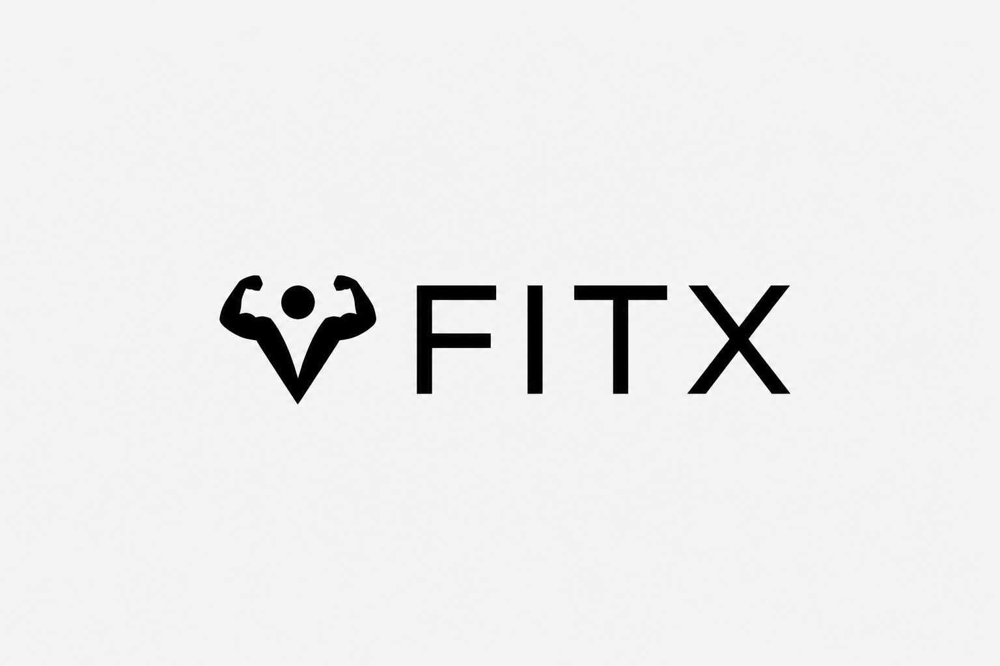

# 🏋️ AI Fitness Trainer

<p align="center">
  
</p>

<p align="center">


</p>

<p align="center">
An AI-powered virtual fitness coach that performs <strong>real-time pose estimation</strong>, <strong>exercise repetition counting</strong>, <strong>form correction</strong>, and <strong>personalized workout planning</strong> using Computer Vision and Large Language Models.
</p>

---

## 📌 Overview

AI Fitness Trainer is an intelligent fitness assistant built with **MediaPipe**, **OpenCV**, **Streamlit**, **LangChain**, and **Groq LLM**.

The application analyzes a user's body posture through a webcam, detects exercise movements in real time, counts repetitions, provides instant posture correction, and generates personalized workout plans based on the user's fitness profile.

Unlike traditional workout trackers, the system combines **Computer Vision** with **Generative AI** to deliver an interactive and personalized fitness experience.

---

## ✨ Key Highlights

* 🎯 Real-time human pose estimation using MediaPipe
* 💪 AI-powered exercise repetition counting
* ✅ Live posture and form correction
* 🤖 Personalized workout recommendations using Groq LLM
* 📅 Built-in workout calendar and scheduling
* 🔐 Secure user authentication
* 📹 Webcam-based exercise tracking
* ⚡ Fast and lightweight Streamlit interface
* 🧠 Modular architecture for adding new exercises easily

---

# 🎥 Demo

> **Live Demo:** *Coming Soon*

### Supported Exercises

* 💪 Bicep Curl
* 🦵 Squat
* 🔥 Tricep Kickback
* 🚶 Lunges
* 🪽 Dumbbell Fly

---

# 📷 Screenshots

| Homepage         | Exercise Detection |
| ---------------- | ------------------ |
|  |   |

| AI Workout Recommendation | Workout Calendar |
| ------------------------- | ---------------- |
| *Add Screenshot*          | *Add Screenshot* |

---

## 🌟 Why This Project?

This project demonstrates the integration of multiple AI technologies into a single end-to-end application.

It combines:

* Computer Vision
* Human Pose Estimation
* Real-time Video Processing
* AI-powered Workout Generation
* Interactive Web Application Development

The architecture is designed to be scalable, making it easy to integrate additional exercises, advanced pose analytics, and future AI fitness features.


---

# 🚀 Features

### 🎯 AI-Powered Pose Estimation

* Detects full-body posture in real time using **MediaPipe Pose**.
* Tracks body landmarks continuously through the webcam.
* Processes live video frames with minimal latency.

### 💪 Exercise Detection & Rep Counting

Supports multiple strength training exercises:

* Bicep Curl
* Squat
* Lunges
* Tricep Kickback
* Dumbbell Fly

The system automatically detects movement phases and accurately counts valid repetitions.

---

### ✅ Real-Time Form Correction

The application continuously evaluates posture and movement quality by analyzing joint angles.

It provides instant feedback for incorrect form, helping users perform exercises safely and effectively.

Examples include:

* Straighten your back
* Move your arm forward
* Move your arm backward
* Face the camera correctly

---

### 🧠 AI Workout Recommendation

Users enter their:

* Height
* Weight
* Fitness Goal
* Experience Level
* Weekly Workout Frequency

Using **LangChain** and **Groq LLM**, the application generates a personalized weekly workout plan tailored to the user's fitness profile.

---

### 📅 Workout Calendar

Generated workout plans are automatically organized into an interactive calendar, allowing users to:

* View scheduled workouts
* Track weekly exercise plans
* Navigate daily and weekly sessions

---

### 🔐 Secure Authentication

* User login authentication
* Encrypted password storage
* Session management using Streamlit

---

### ⚡ Modular Architecture

The project follows a modular design where each exercise has:

* Independent processing pipeline
* Dedicated threshold configuration
* Separate pose analysis logic

This architecture makes adding new exercises simple and scalable.

---

# 🛠️ Tech Stack

| Category            | Technologies                  |
| ------------------- | ----------------------------- |
| **Language**        | Python                        |
| **Frontend**        | Streamlit                     |
| **Computer Vision** | OpenCV, MediaPipe             |
| **AI / LLM**        | LangChain, Groq Llama 3.3 70B |
| **Video Streaming** | Streamlit WebRTC              |
| **Authentication**  | Streamlit Authenticator       |
| **Scheduling**      | Streamlit Calendar            |
| **Data Processing** | NumPy, Pandas                 |
| **Environment**     | Python Dotenv                 |
| **Deployment**      | Docker                        |

---

# 🏗️ System Architecture

```text
                    Webcam
                       │
                       ▼
             MediaPipe Pose Detection
                       │
                       ▼
            Body Landmark Extraction
                       │
                       ▼
          Joint Angle Computation
                       │
                       ▼
        Exercise State Classification
                       │
                       ▼
     Rep Counting & Form Validation
              │                 │
              │                 │
              ▼                 ▼
      Live Feedback        Exercise Counter
              │
              ▼
         Streamlit Dashboard


      ──────────────────────────────

      User Fitness Information
                 │
                 ▼
          LangChain Prompt
                 │
                 ▼
          Groq LLM Generation
                 │
                 ▼
     Personalized Workout Plan
                 │
                 ▼
       Interactive Calendar
```

---

# 📂 Project Structure

```bash
AI-Fitness-Trainer/
│
├── assets/                         # Images and README assets
│
├── pages/
│   ├── Bicep Curl AI Trainer.py
│   ├── Squat AI Trainer.py
│   ├── Lunges AI Trainer.py
│   ├── Tricep KickBack.py
│   ├── Dumbbell Fly AI Trainer.py
│   ├── Exercise Recommendation.py
│   └── Calendar.py
│
├── Homepage.py                     # Main application
├── Login.py                        # Authentication
│
├── process_frame_*.py              # Exercise processing pipelines
├── threshold_*.py                  # Exercise threshold configurations
├── utils.py                        # Pose utilities & angle calculations
│
├── requirements.txt
├── Dockerfile
└── README.md
```

---

# ⚙️ Core Functionalities

* Real-time pose estimation
* Joint angle computation
* State-machine based repetition counting
* Form correction feedback
* Personalized AI workout generation
* Workout scheduling
* Secure authentication
* Modular exercise processing pipeline

---


---

# ⚙️ Installation

## 1️⃣ Clone the Repository

```bash
git clone https://github.com/Dhruv-sehra/AI-Fitness-Trainer.git
cd AI-Fitness-Trainer
```

## 2️⃣ Create a Virtual Environment

**Windows**

```bash
python -m venv venv
venv\Scripts\activate
```

**macOS / Linux**

```bash
python3 -m venv venv
source venv/bin/activate
```

---

## 3️⃣ Install Dependencies

```bash
pip install -r requirements.txt
```

---

## 4️⃣ Configure Environment Variables

Create a `.env` file in the project root.

```env
GROQ_API_KEY=your_groq_api_key
```

---

## 5️⃣ Run the Application

```bash
streamlit run Homepage.py
```

The application will launch in your default browser.

---

# 🚀 Usage

### Step 1

Launch the application and log in.

### Step 2

Choose an exercise trainer.

### Step 3

Allow webcam access.

### Step 4

Perform the exercise while maintaining proper posture.

### Step 5

Receive:

* Live pose estimation
* Automatic repetition counting
* Real-time posture correction

### Step 6

Generate a personalized AI workout plan by entering your fitness profile.

### Step 7

Review your workout schedule in the integrated calendar.

---

# 🎯 Exercise Detection Pipeline

```text
User Starts Exercise
        │
        ▼
 Webcam Captures Frames
        │
        ▼
 MediaPipe Pose Detection
        │
        ▼
 Body Landmark Extraction
        │
        ▼
 Joint Angle Calculation
        │
        ▼
 Exercise State Recognition
        │
        ▼
 Form Validation
        │
        ▼
 Rep Counter Update
        │
        ▼
 Live Feedback Display
```

---

# 📈 Future Enhancements

* 📱 Mobile-friendly interface
* 🧠 AI nutrition and meal planning
* 📊 Progress analytics dashboard
* ❤️ Heart rate and wearable integration
* ☁️ Cloud database for workout history
* 🎙️ Voice-guided workout assistant
* 🏋️ Additional exercise support
* 📹 Workout history and session recording
* 🌍 Multi-language support

---

# 🤝 Contributing

Contributions are welcome!

If you'd like to improve this project:

1. Fork the repository.
2. Create a new feature branch.
3. Commit your changes.
4. Push your branch.
5. Open a Pull Request.

Please ensure your code follows the project's coding standards and includes clear documentation.

---

# 📄 License

This project is licensed under the **MIT License**.

See the `LICENSE` file for more information.

---

# 👨‍💻 Author

**Dhruv Sehra**

AI & Machine Learning Developer

If you found this project helpful, consider giving it a ⭐ on GitHub.

---

## ⭐ Support

If you like this project:

* ⭐ Star the repository
* 🍴 Fork the project
* 🛠️ Contribute new features
* 🐞 Report issues
* 💡 Share suggestions

Your support helps improve the project and motivates future development.

